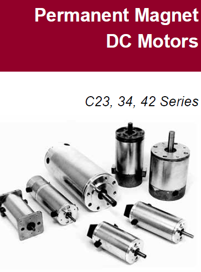
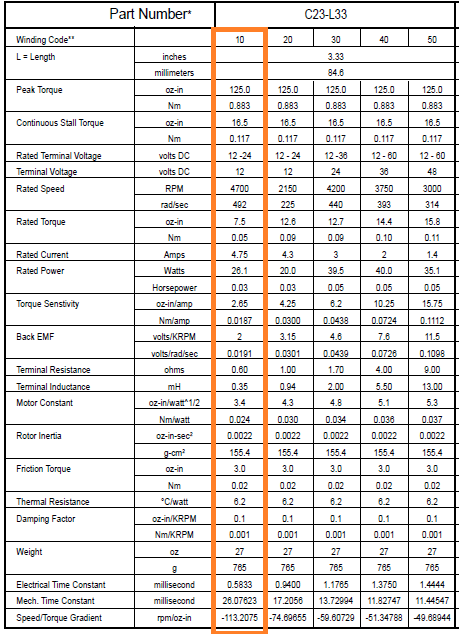
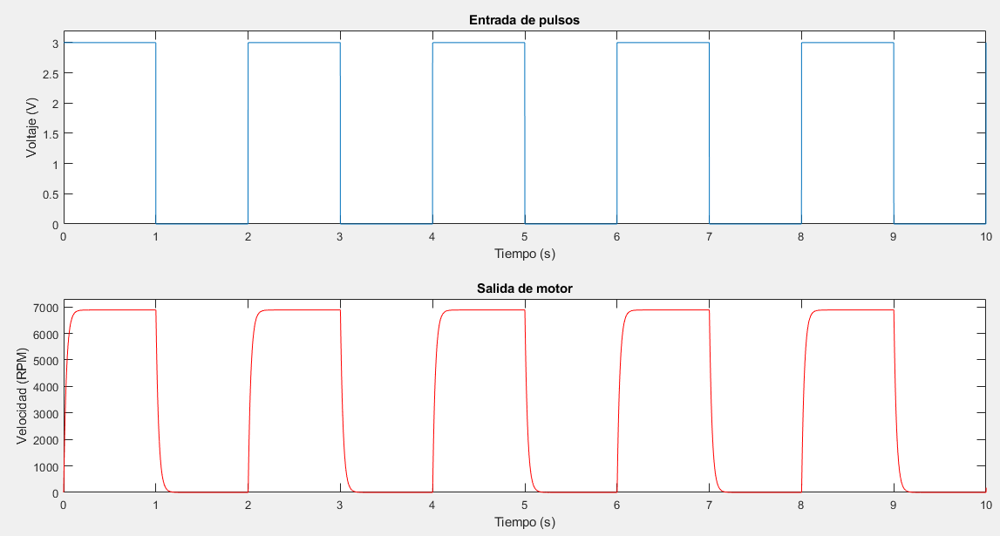
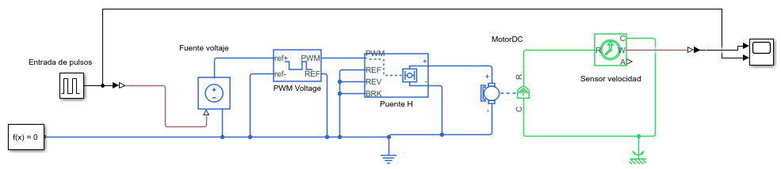
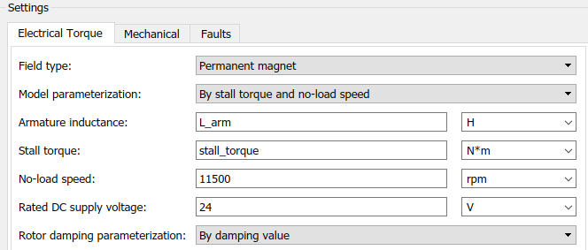
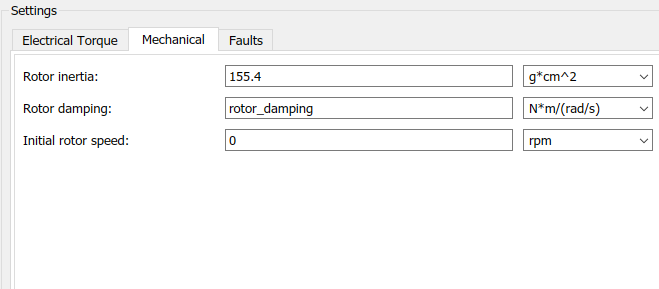
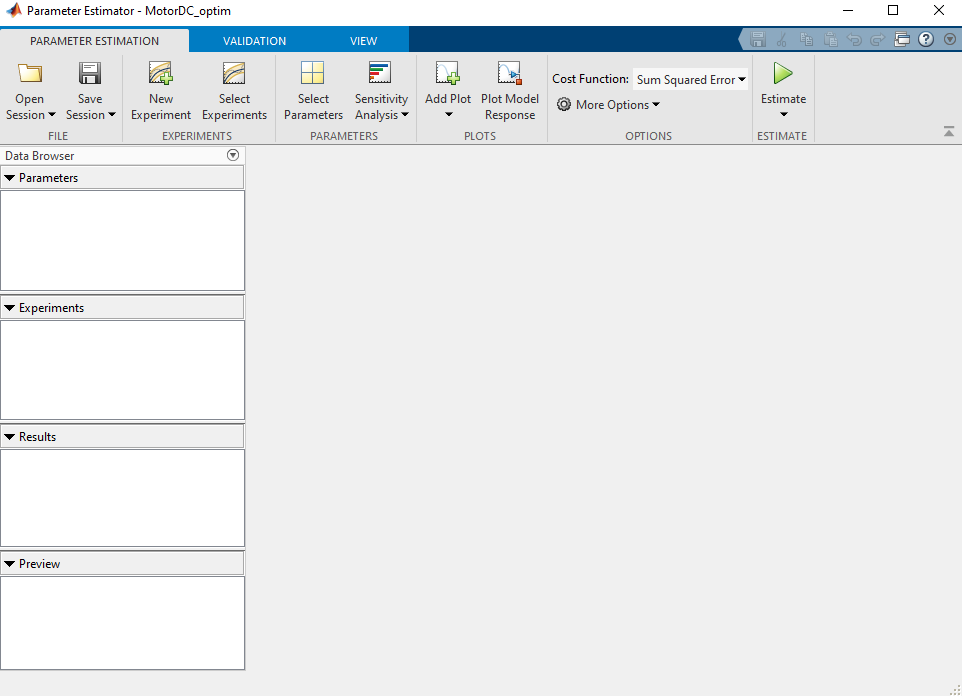
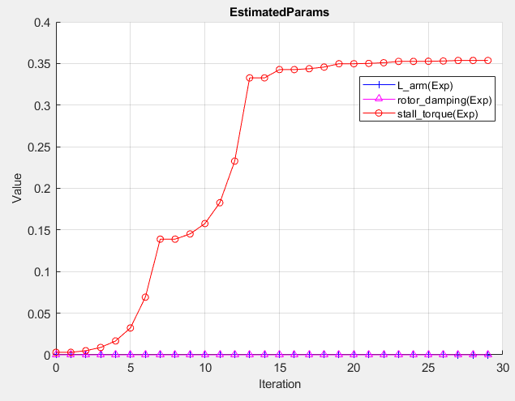
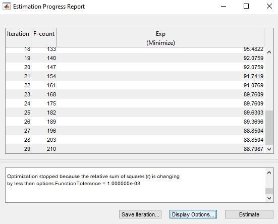
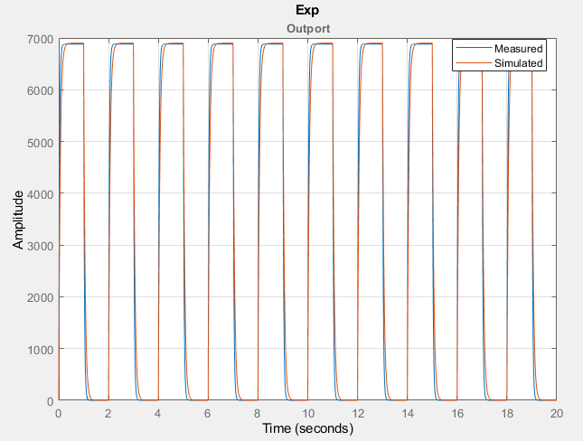

# Estimación de Parámetros de un sistema
A continuación se presenta el procedimeinto para la estimación de parámetros estáticos de un sistema utilizando datos de entrada y salida. El proceso se realiza a partir de la optimizacióin de la respuesta iterando diferentes valores de parámetros hasta encontrar los óptimos.
Simulink / Matlab tiene una herramienta para llevar a cabo este proceso y de esta manera poder obtener un modelo de simulación Simscape, función de transferencia o espacio de estados
## Motor que se quiere modelar
Se presenta un ejemplo donde se pretende obtener los parámetros internos de un motor DC (inductancia, resistencia, constantes de transformación, etc.). El motor utilizado es el Moog C23L33W10



Los parámetros que presenta el fabricante están dados en terminos del torque y la velocidad que puede alcanzar el motor en vacío y a plena carga



De la figura anterior se puede observar que el fabricante no entrega parámetros internos como la inductancia y resistencia de armadura, o las constantes de conversión de energías necesarias si se quiere obtener un modelo por corriente de armadura o corriente de campo.

A este motor Moog C23L33W10 se le realizan pruebas en lazo abierto, de tal manera que se pueda obtener información de la dinámica del motor y a partir de esto llegar a un modelo aproximado al comportamiento real.

## Metodología de Uso de herramienta de estimación de parámetros
Para realizar la estimación de parámetros de cualquier sistema es posible reducir el procedimiento a los siguientes pasos:

* Recopilar los datos de entrada y salida del sistema por medio de una tarjeta de adquisición de datos, un osciloscopio o un microcontrolador+Simulink
* Crear un modelo en simulink que represente el sistema del que no se conocen todos los parámetros
* Declarar los parámetros que se quieren estimar como variables y configura aquellos parámetros que son conocidos en el modelo Simulink
* Abrir la herramienta de estimación de parámetros y verificar que los parámetros que se van a estimar están configurados
* Ejecutar la herramienta para que corra el algoritmo de optimización

## Datos recopilados del motor DC Moog C23L33W10

Se configuró el motor en lazo abierto, con su respectivo puente H y se le aplico una señal de tren de pulsos para repetir su dinámica varias veces de manera periódica. La figura muestra la señal de entrada que se aplica y la respuesta del motor en terminos de velocidad en RPM.

Teniendo los datos de la prueba almacenados en una estructura de matlab que tiene la siguiente ruta:
* Para la entrada 'MotorDC{2}.Values.Data' y 'MotorDC{2}.Values.Time' para la base de tiempo
* Para la respuesta de la velocidad en RPM 'MotorDC{1}.Values.Data' y 'MotorDC{1}.Values.Time' para la base de tiempo

El código en Matlab para graficar la entrada y salida a partir de los datos almacenados en las estructuras anteriormente mencionadas puede escribirse asi:
```
>> subplot(2,1,1)
>> plot(MotorDC{2}.Values.Time, MotorDC{2}.Values.Data)
>> title('Entrada de pulsos')
>> ylabel('Voltaje (V)')
>> xlabel('Tiempo (s)')
>> axis([0 10 0 3.2])
>> subplot(2,1,2)
>> plot(MotorDC{1}.Values.Time, MotorDC{1}.Values.Data, "red")
>> title('Salida de motor')
>> ylabel('Velocidad (RPM)')
>> xlabel('Tiempo (s)')
>> axis([0 10 0 7300])
```


## Creación de modelo Simulink
Para este caso se utilizará el paquete Simscape de Simulink, el cual cuenta con un modelo parametrizado de un motor DC, lo cual facilitará la creación del modelo. 



En la imagen se observa bloques de paquete Simscape que representan el modelo matemático de un motor DC, conectado a un puente H como driver de potencia y un generador de PWM para conmutar los transistores del puente H. Los dos últimos son modelos ideales en los cuales no se configuró ningún parámetro.

Para este caso se han configurado aquellos parámetros que se encuentran en la documentación dada por el fabricante y se dejan para estimar 3 parámetros que son desconocidos y que sería difícil medir:

* L_arm es la inductancia de armadura del motor. Se le da un valor inicial arbitrario $3.2x10^(-5)$
* rotor_damping es el coeficiente de amortiguamiento del eje del motor. Se le da un valor inicial de $1x10^(-7)$
* stall_torque es el torque de operación del motor. Se le da un valor inicial de $0.003$

  Todos los otros parámetros se han configuardo de acuerdo a los datos dados en el datasheet. La siguiente imágen muestra los parámetros configurados:





  

## Herramienta de estimación de parámetros
Para utilizar la herramienta de estimación de parámetros, el modelo que se quiere optimizar debe estar abierto. Posterormente se debe abrir la herramienta que se encuentra en la ruta:

>*Apps->Control Systems->Parameter Estimator

Con esto se abre una sesión de la aplicación de estimación de parámetros junto con la interfaz de usuario que tendrá el aspecto que se observa en la figura



Posteriormente configure un nuevo experimento de estimación de parámetros. Para la configuración de un nuevo experimento tenga en cuenta lo siguiente:

* Utilice 'outport' para representar todos los puntos del modelo de los cuales se tenga datos reales y conectelos
* Al crear el nuevo experimento se despliega una ventana donde en la primera sección debe configurar los datos de salida tomados del sistema real
* Configure los parámetros que va a estimar haciendo check en las respectivas variables
* Corra el exprimento de estimación

  ## Resultados de la estimación
Durante el proceso de estimación se van viendo resultados que permite establecer si el algoritmo presenta convergencia para encontrar los parámetros del experimento.

Por ejemplo se tiene la gráfica que va variando con el valor que va tomando cada parámetro durante la ejecución del algoritmo. En la siguiente figura se muestra el resultado del ejemplo del motor Moog C23L33W10.



También durante la ejecución se va generando una tabla que muestra si se esta minimizando la función de costo. La sigueinte figura muestra los resultados para el ejemplo del motor DC



Después de terminar la ejecución del algoritmo también es posible verificar algunos resultados, por ejemplo verificar que tanto se logró ajustar la respuesta del modelo a la respuesta real del sistema. La siguiente figura muestra los resultados del motor DC Moog



Al final los resultados obtenidos son los siguientes:

* L_arm = $4.16x10^(-8)$
* rotor_damping = $1.086x10^(-7)$
* stall_torque = $0.3537$

## Referencias

https://la.mathworks.com/help/sldo/gs/estimate-parameters-from-measured-data-using-the-gui.html
https://la.mathworks.com/videos/how-to-estimate-model-parameters-from-test-data-with-simulink-1632388166208.html
